# HealthWallet — Complete App Architecture & User Flow

> **Health OS — Single Source of Truth for your body.**
> Three data pillars: Episodic (labs), Continuous (HealthKit), Subjective (mood logs).

---

## 1. App Launch & Authentication Flow

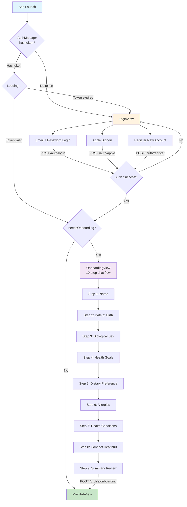

---

## 2. Main Tab Navigation

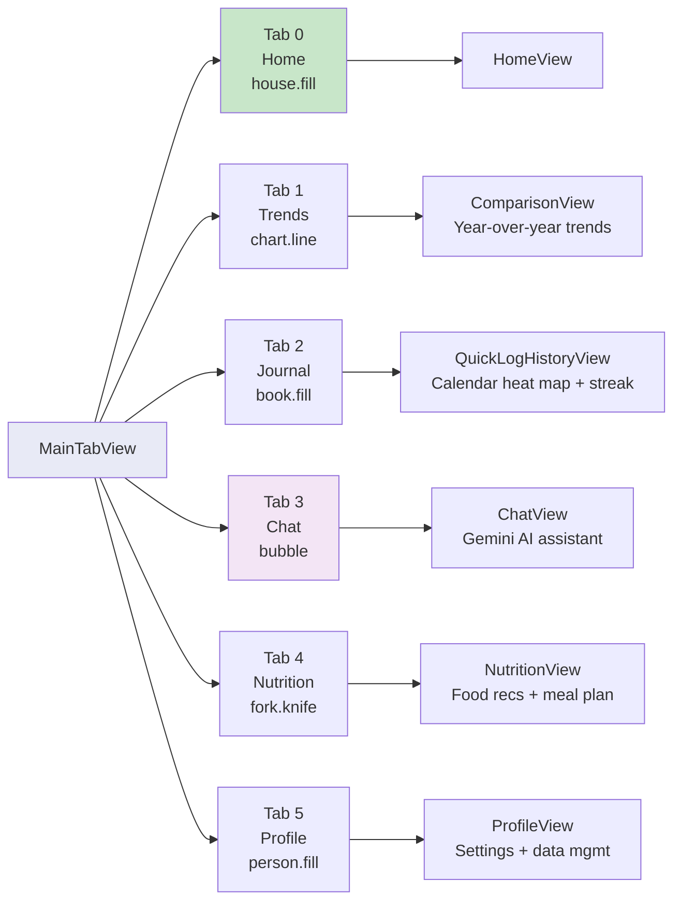

---

## 3. Home Screen State Machine

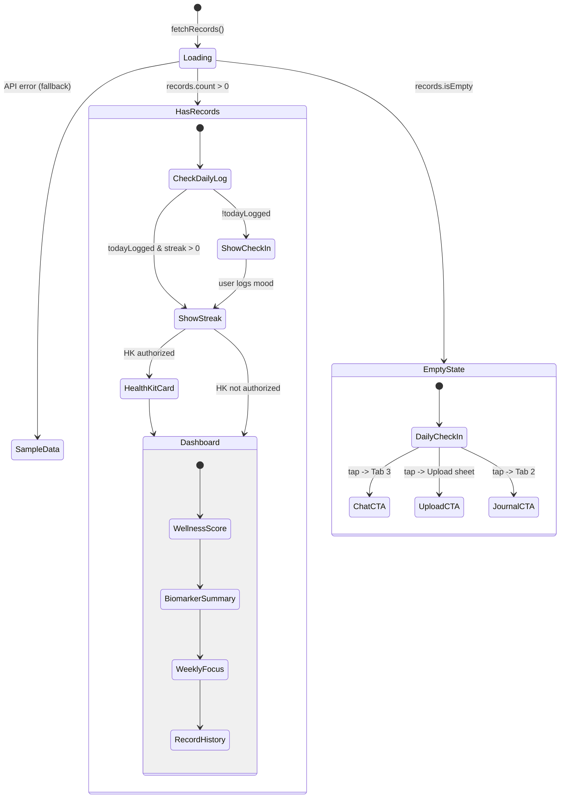

---

## 4. PDF Upload & Analysis Pipeline

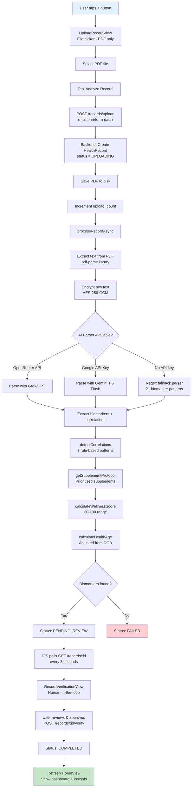

---

## 5. Data Triangle Architecture

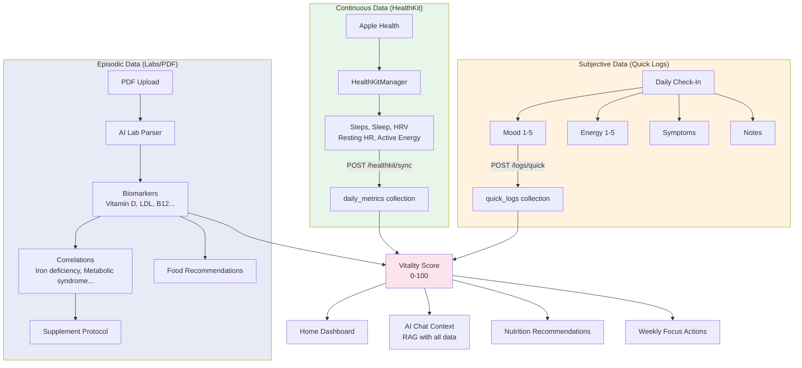

---

## 6. Weekly Focus Action Flow

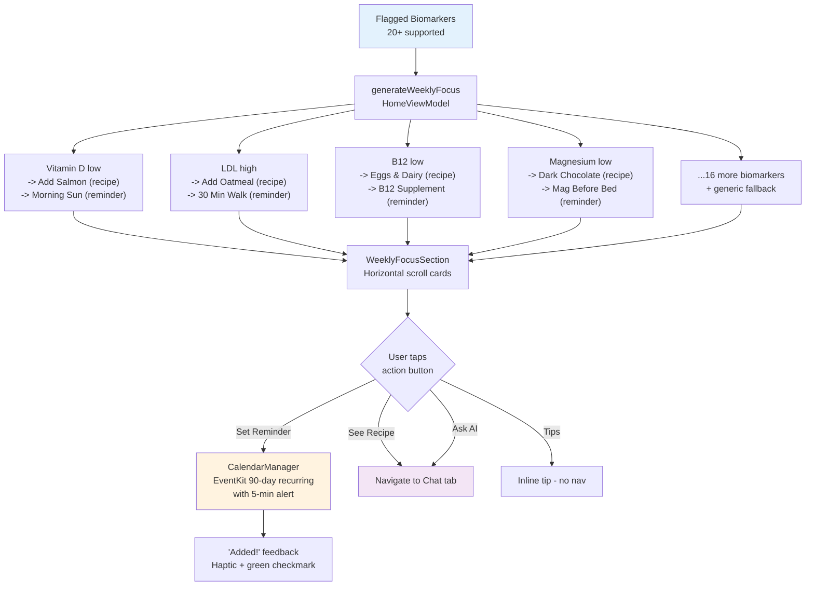

---

## 7. AI Chat System

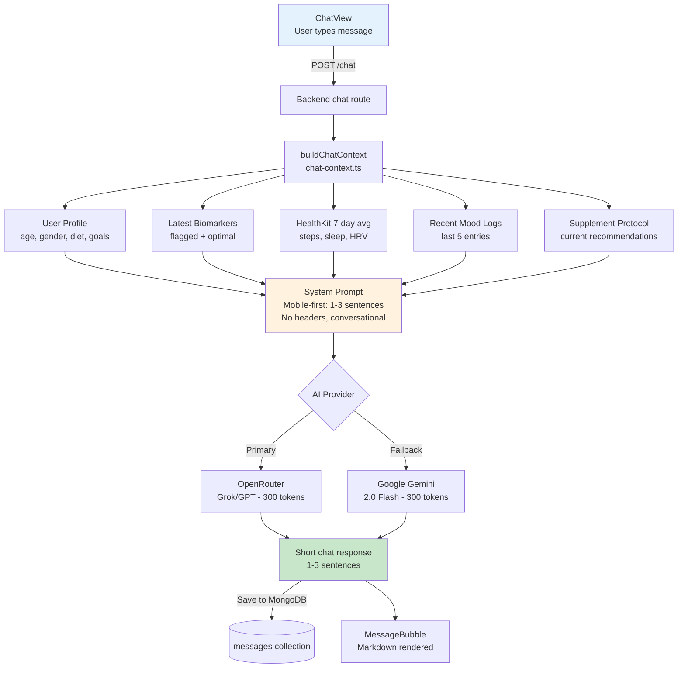

---

## 8. Backend API Map

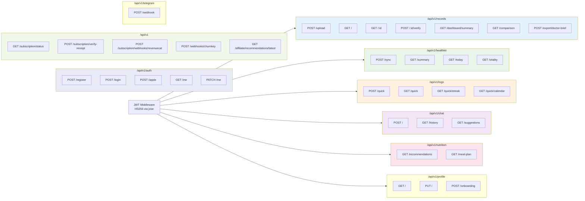

---

## 9. Subscription & Monetization Flow

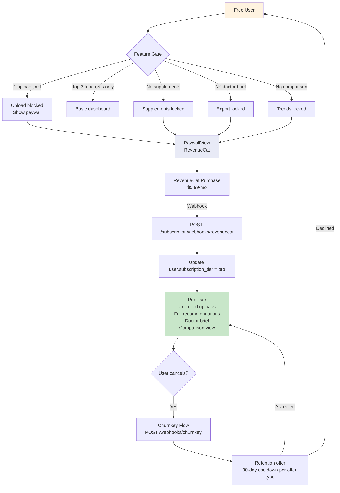

---

## 10. Nutrition Engine Flow

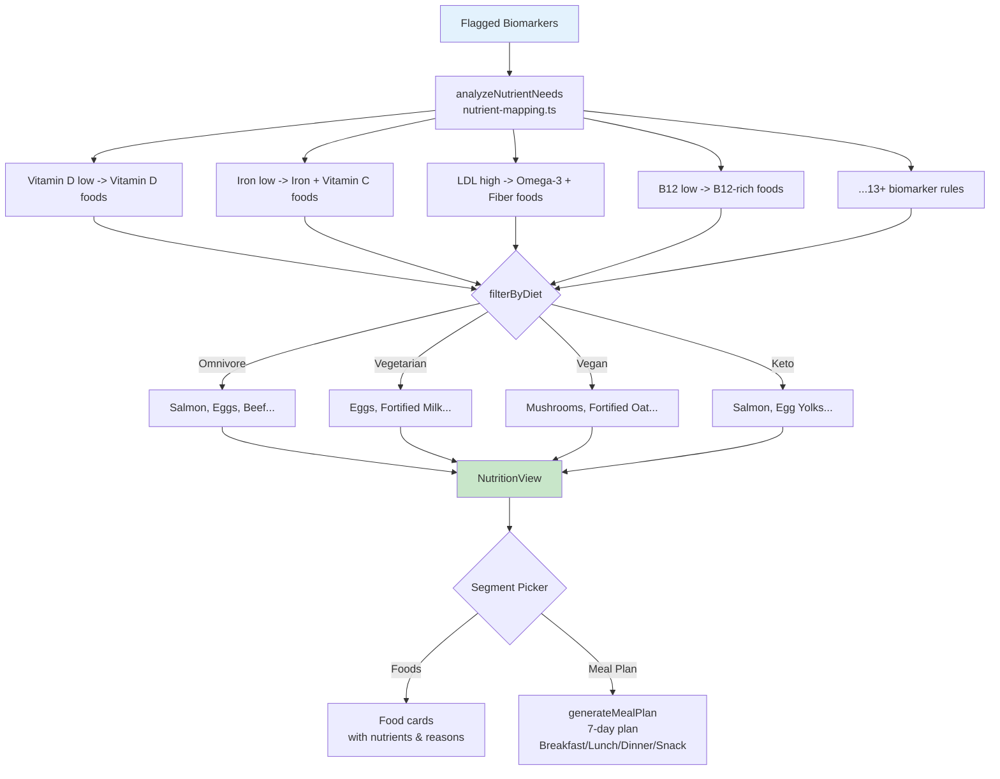

---

## 11. Telegram Bot Integration

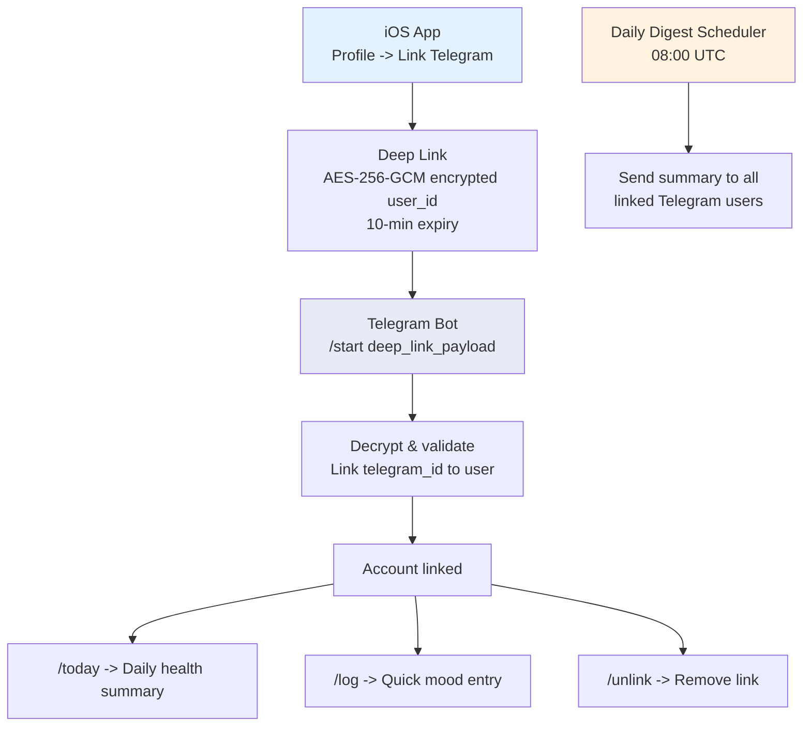

---

## 12. Complete Data Model

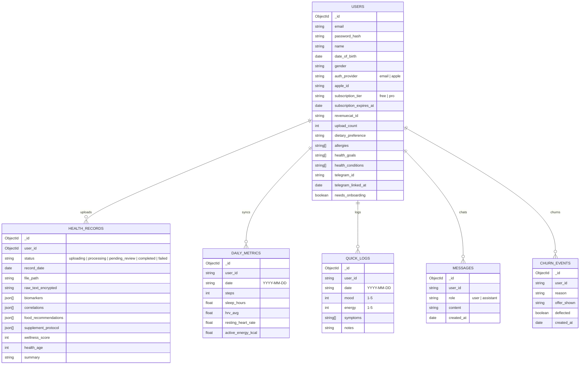

---

## 13. Infrastructure

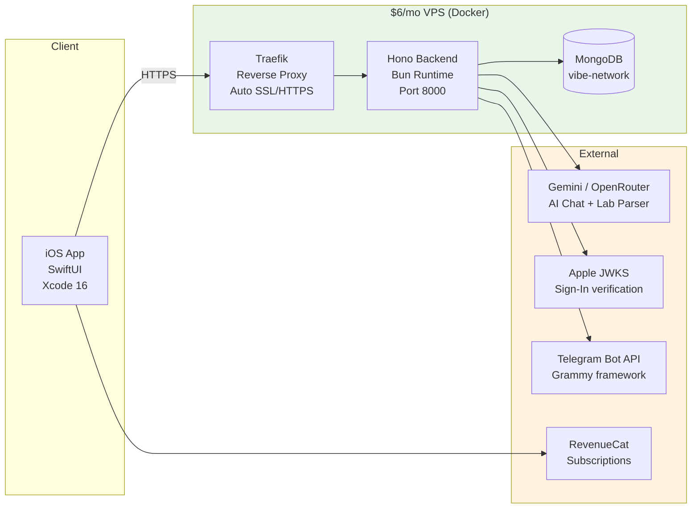

---

## Tech Stack Summary

| Layer | Technology |
|-------|-----------|
| iOS | Swift 5.9+, SwiftUI, @Observable, HealthKit, EventKit |
| Backend | Hono (TypeScript) on Bun runtime |
| Database | MongoDB (Docker, vibe-network) |
| AI | Gemini 2.0 Flash / OpenRouter (Grok) |
| Auth | JWT (jose, HS256), Apple Sign-In (JWKS), bcrypt |
| Encryption | AES-256-GCM (Web Crypto API) |
| Payments | RevenueCat + Churnkey |
| Infra | Docker + Traefik, self-hosted VPS |
| Bot | Telegram via Grammy, webhook mode |
| PDF | pdf-parse + AI/regex extraction |
